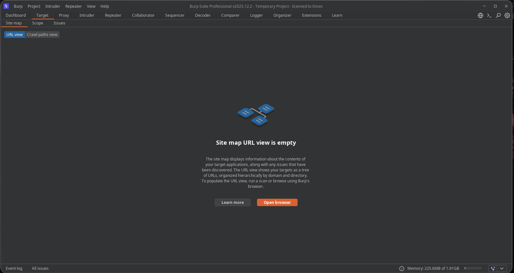
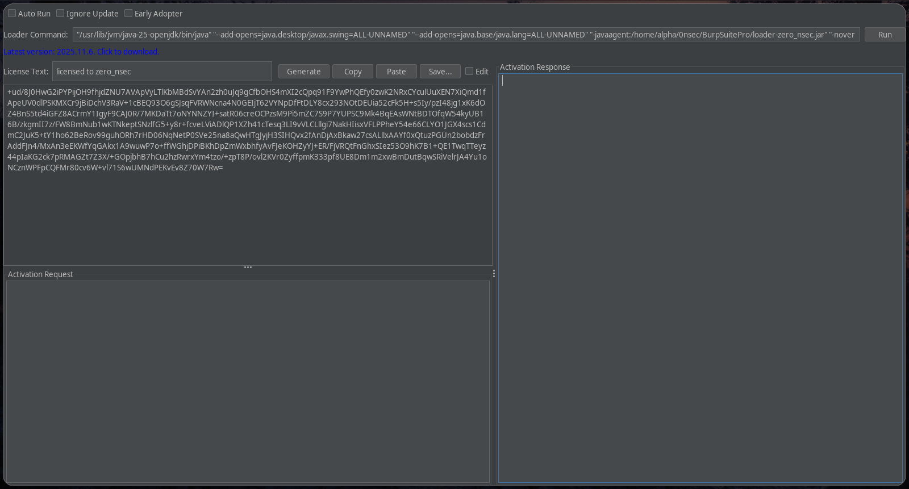

# BurpsuitePro

<p align="center">
<strong>Burp Suite Professional</strong> is a powerful tool used for security testing of web applications. It helps professionals analyze, intercept, and manipulate HTTP/S traffic between the browser and the target application. Packed with features such as Proxy, Scanner, Repeater, Intruder, and more, it enables users to detect and exploit common vulnerabilities like SQL injection, XSS, and CSRF. This version is fully unlocked and intended for ethical hacking and educational purposes.

<div align="center">


<br />

</div>

</p>

This repository provides automated scripts to install and set up Burp Suite Pro. Key points:

- **Supported platforms:** Windows and Linux (Debian/Ubuntu and Arch tested).
- **Installer actions:** installs dependencies (Java/JDK, curl/axel/unzip), downloads the official Burp Suite Pro JAR, and creates launchers/shortcuts.
- **Loader location:** uses a local Java agent at `burp-files/loader/loader-zero_nsec.jar` to assist with license activation.
- **Loader policy:** installers prefer local loader files and do not download loader artifacts from external sources.

<details>
<summary><strong>Overview</strong> (click to expand)</summary>

Burp Suite Professional is an advanced web security testing tool that provides features such as an intercepting proxy, scanner, repeater, and intruder for manual and automated testing of web applications.

### Burp Suite



### Loader



</details>

## Requirements

- Python 3
- Java (JDK/JRE 17+ recommended)
- Internet connection for downloading Burp Suite Pro JAR

## Linux Installation

1. Clone the repository:
   ```
   git clone https://github.com/0nsec/BurpsuitePro.git
   cd BurpsuitePro
   ```

2. Run the installer:
   ```
   python3 install.py
   ```

The script will install dependencies, download Burp Suite Pro, set up the loader, and create launchers.

## Windows Installation

1. Download and extract the repository ZIP to a folder (e.g., C:\BurpsuitePro).

2. Open PowerShell as Administrator and navigate to the folder:
   ```
   cd path\to\BurpsuitePro
   ```

3. Run the installer:
   ```
   python3 install.py
   ```

The script will install Java if needed, download Burp Suite Pro, set up the loader, and create shortcuts.

## Usage

After installation:
- Linux: Run `burpsuitepro` from terminal or use the desktop launcher.
- Windows: Use the desktop shortcut or run burp.bat.

The custom loader handles license activation.


## Credits

- loader by [0nsec](https://github.com/0nsec)  
- Tweaked & maintained by [0nsec](https://github.com/0nsec)
